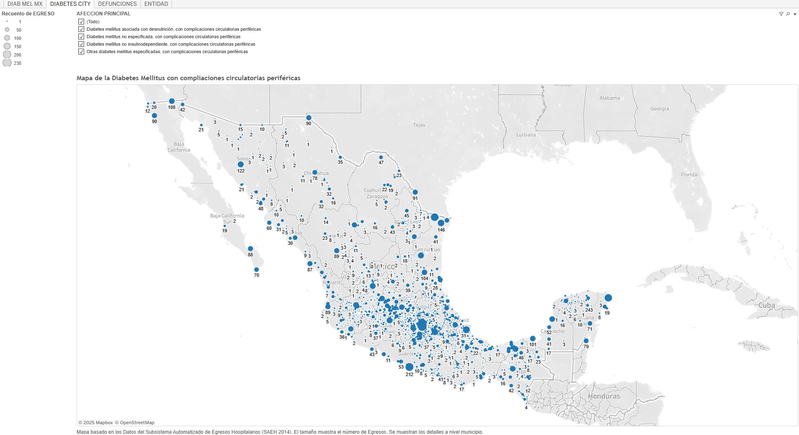

# Portfolio Projects
## Following are my projects in SQL, Python, Tableau & Excel:  
#### *Review profesional profile for these projects
#### *You can also take a look at my Linkedin : [David Mares](https://www.linkedin.com/in/davidmaressilva/)*  

- [x] **Tableau** - 

*Para ver estos tableros en Tableau Public, seguir el vínculo
- Plan Maestro de Infraestructura Física en Salud

*Es el instrumento rector para la planeación, desarrollo y reordenamiento de la infraestructura y el equipamiento médico de la Secretaría de Salud y de los servicios estatales de salud, con el fin de racionalizar y priorizar los recursos para la inversión pública y garantizar la operación sustentable* **[Dashboard]  https://public.tableau.com/shared/ZHGQ9DT6P?:display_count=n&:origin=viz_share_link **  

- Diabetes Mellitus con complicaciones perifericas SAEH214 
*Visualización de las complicaciones circulatorias periféricas asociadas a Diabetes Mellitus en México, como herramienta de planeación para la venta de insumos médicos asociados al píe diabético.*
**[Dashboard]  https://public.tableau.com/views/DiabetesMellitusconcomplicacionesperifericasSAEH214/ENTIDAD?:language=es-ES&:sid=&:redirect=auth&:display_count=n&:origin=viz_share_link **  

- [x] **PowerBI** - 
- Padrón de Beneficiarios del Instituto Mexicano del Seguro Social

- [x] **Lookerstudio** - 
- Egresos Hospitalarios 2023 México

- [x] **Python** - 
- Encuesta Nacional de Salud y Nutrición
